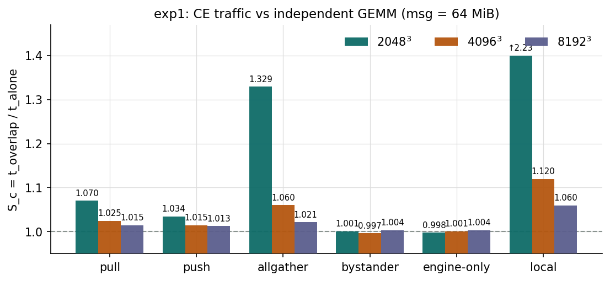
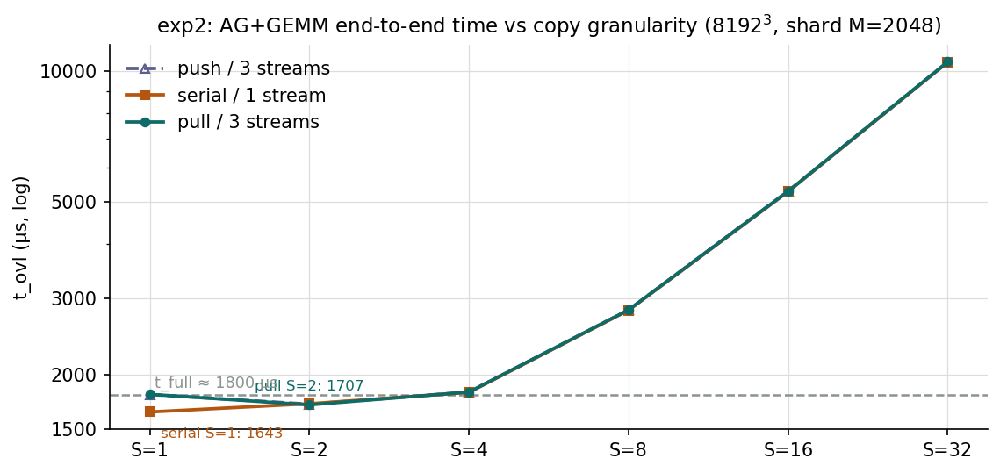
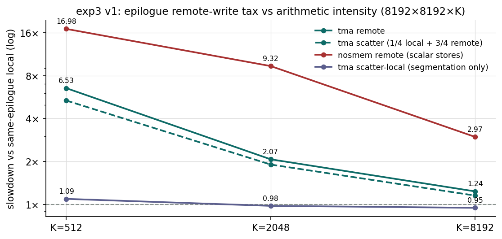
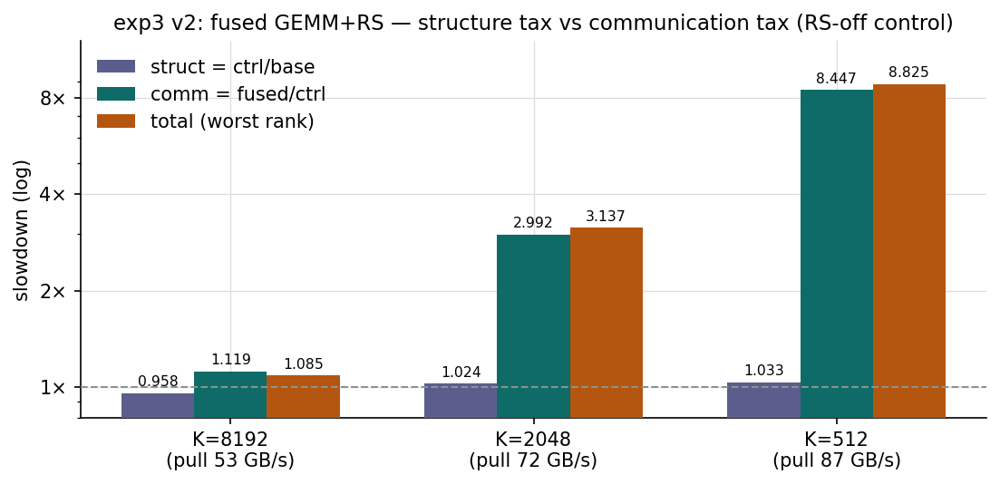
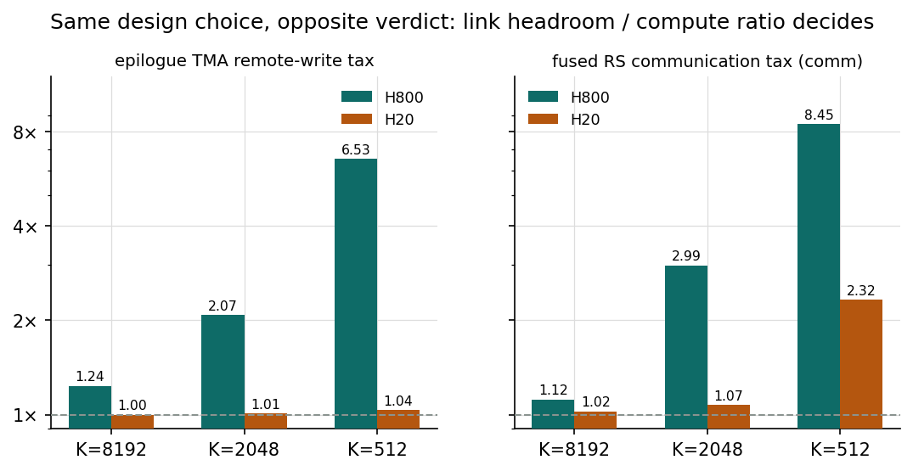
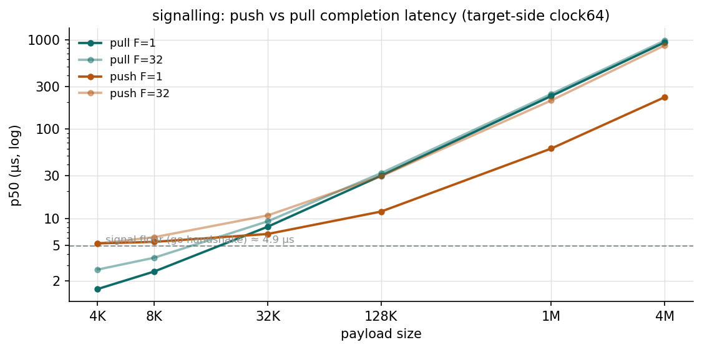

# 4×H800 通信/计算重叠基准报告

- **数据**：`comm_comp/results_20260810_121354/` + `signalling/signalling_4xH800.csv`（QUICK=0）
- **代码**：git `06cb8b0`（含全部方法学修复：环境预检、配对 baseline、fused RS-off 对照、signalling 计时边界）
- **环境**：8×H800，CUDA 12.9 / CUTLASS 4.6 / 驱动 535.161.08，GPU 0–3 锁频 **1830 MHz**（跑前跑后一致），实验 world=4
- **H20 对照**：`../comm_comp_signalling_4xH20/`（同一二进制、同一方法学，4×H20 NV18）
- **图**：`python plot_report.py` 从 CSV 重新生成，输出到 `figs/`

---

## 0. 可信度判定：可信（一处存疑）

| 检查项 | 证据 | 结论 |
|---|---|---|
| GPU 空闲 | 8 卡全部 0% util / 0 MiB / ~120 W 静息，预检通过 | ✅ |
| 锁频 | GPU 0–3 跑前跑后均 1830 MHz（`clocks.current.sm`） | ✅ |
| 代码与构建 | `06cb8b0`，build.log 全新编译，QUICK=0（200 ms 窗口 / 50 iters） | ✅ |
| 配对 baseline | 四条 recheck 漂移 +0.5% / +0.6% / −0.3% / +0.4%（阈值 5%） | ✅ |
| 数值验证 | exp2 verify ok；exp3 v1 全 bitwise ok；fused 全 rank rel ≤ 0.018 | ✅ |
| 对照组自检 | bystander 1.001–1.004、engine-only 0.998–1.004（物理预期 = 1.00） | ✅ |
| 跨二进制一致 | 8192³ GEMM：exp1 1704.8 µs ≡ exp3 v1 tma local 1704.8 µs；fused base 1748–1812（多卡对称执行略高） | ✅ |
| signalling 构建 | pull 4K = 1.62 µs ≈ 计时修复**前**旧值 1.66（修复后 H20 为 2.27） | ⚠️ 存疑 |

**存疑项说明**：`run_all.sh` 只构建 comm_comp，signalling 的 `signal_fanin` 二进制疑似未随
`06cb8b0` 重编译。若属实，pull ≤32K 的点被低估约 0.5–1 µs（barrier 释放偏斜），大消息点与全部
push 系数据不受影响。跑分机上 `cd signalling && make -B` 后重跑即可确认。
*（已证实并解除：20260811 轮重编译后复跑 pull 4K = 2.56 µs，本轮的 1.62 确系陈旧二进制欠计时；
以 `../benchmark_4xH800_20260811/` 的 signalling 数据为准。）*

---

## 1. exp1：CE 流量对独立 GEMM 的干扰——全是本地 HBM 的账

- **engine-only ≈ bystander ≈ 1.00**：CE 引擎本身和 NVSwitch 环境流量（实测 490 GB/s 穿过交换机）
  都不花钱。干扰的全部来源是**本地 HBM 带宽竞争**。
- **代价随 GEMM 算术强度收敛**：pull 从 2048³ 的 7.0% 降到 8192³ 的 1.5%；完整 allgather
  从 32.9% 降到 2.1%。小 GEMM 掩不住访存，大 GEMM 几乎白拿。
- **排序符合每字节 HBM 成本**：local（本地读+写，2048³ 时 2.23×）> allgather > pull > push ≈ 对照组。
- **消息粒度 ≥4 MiB 后无感**（msgsweep）：4M–256M 的 S_c 稳定在 1.013–1.026；1 MiB 点 host 泵
  喂不满（CE idle 标记，S_c 1.275 是发射开销伪影）。GEMM 满载下 CE 拉取仍维持 173–176 GB/s，
  与空载相同——**反向干扰也为零**。

## 2. exp2：AG+GEMM 拷贝粒度——粗粒度赢，细粒度被 tile 量化吃掉

8192³、shard M=2048、AG 总量 96 MiB。S = 每个远端 shard 切成的 chunk 数（S=1 即 flux `SPLIT==1`）。

- **最优点：serial S=1（1643 µs）与 pull/push S=2（1707 / 1713 µs）**，都快于不分段的
  t_full（≈1800 µs）。S≥8 崩塌：S=32 时 10.5 ms，e2e 只剩 105 TFLOP/s。
- **反直觉观测：分段 GEMM 本身比整块快**（seg_eff 最高 1.35，M=2048 分段跑出 ~805 TFLOP/s，
  高于整块的 645）。重叠不只免费、还倒赚。H20 上同一实验 seg_eff 只有 0.965——这是 H800
  132 SM 下该 tile 配置的波次/局部性效应，**不能跨硬件外推**。
- **通信侧对粒度完全不敏感**（t_comm ≈ 578 µs / 174 GB/s 恒定到 S=16），所以"更细的重叠粒度"
  没有任何收益端，全部代价在计算侧 tile 量化。flux 拷贝端 SPLIT=1、消费端 tile 级自旋，两头都对。
- 16384×8192×8192（shard M=4096）同形：最优 S=2（3304 µs），S≥16 崩塌。

## 3. exp3 v1：epilogue 远端写税——随算术强度急剧放大

- **TMA 远端写：1.24×（K=8192）→ 2.07×（K=2048）→ 6.53×（K=512）**。远端 D 写带宽被
  NVLink 封顶在 ~142–164 GB/s，而 K=512 时本地写需求 972 GB/s——差距就是税率。
- **scatter ≈ remote、scatter-local ≈ 1.0**（8192³ 时 0.95，与 exp2 的 seg_eff>1 同源）：
  代价全部来自远端性，分段本身免费。
- **nosmem（寄存器标量 store）远端 3.0–17.0×**，带宽塌到 23 GB/s——sm80 式直写搬上 NVLink
  必须至少走 TMA/向量化路径，否则完全不可用。

## 4. exp3 v2：fused GEMM+RS——ctrl 对照把结构税和通信税拆开

flux sm90 真实设计（本地 TMA store + 逐 tile flag + fetch/reduce warp 拉取归约），4 进程对称执行。
**ctrl 组**（同一 kernel、运行时关通信）把归因拆干净：`struct = ctrl/base`（静态调度器 + XOR
swizzle + smem carveout），`comm = fused/ctrl`（纯通信）。

| shape | base µs | ctrl µs | fused µs | struct | comm | total (worst) | pull GB/s | verify |
|---|---:|---:|---:|---:|---:|---:|---:|---|
| 8192³ | 1781 | 1706 | 1908 | **0.957** | **1.119** | 1.085 | 52.8 | ok |
| 8192×8192×2048 | 455 | 466 | 1393 | 1.024 | 2.99 | 3.14 | 72.3 | ok |
| 8192×8192×512 | 132 | 136 | 1151 | 1.034 | 8.45 | 8.83 | 87.5 | ok |

- **K=8192：通信净代价 1.12×**（含全部 96 MiB NVLink 拉取 + fp16 归约 + 等最慢 peer）。
  而 **struct = 0.957——结构改造不亏反赚 4%**（静态调度器 + swizzle 在此 shape 小胜 stock，
  与 exp2/v1 的分段增益同源）。之前没有 ctrl 组时，1.07 的表观总代价低估了通信、高估了结构。
  *（20260811 M-sweep 修正：该增益是大 shape 限定条款——仅 m≥4096 成立，m=1024–2048 时
  struct 反亏 4–8%；见 `../benchmark_4xH800_20260811/ANALYSIS_MSWEEP_4xH800.md`。）*
- fused 有效拉取只有 53 GB/s（CE 能跑 176）：瓶颈在**单 fetch warp 的 TMA 拉取路径与 flag 同步**，
  不在链路。
- **低算强下融合完全不划算**：fused 有 ~1.15–1.39 ms 的通信地板，K=512 时是 baseline 的 8.8×。
  这类 fusion 只该用于大 K 的 TP 层。
- **与 v1 对照回答核心问题**：K=8192 下 pull 式 RS 总代价 1.07×（还完成了完整归约），
  epilogue 远端写 1.24×（只是写过去）——**flux 在 H800 上选 pull 是净赚的**。

## 5. H800 vs H20：同一设计选择在两代卡上翻转

| 指标 @ K=8192 | H800 | H20 | 解释 |
|---|---:|---:|---|
| CE 流量干扰（allgather） | 1.021 | 1.001 | 都近似免费；H20 HBM 余量更大 |
| epilogue TMA 远端写 | **1.236** | **1.000** | H800 链路顶不住 epilogue 写压，H20 完全无感 |
| fused RS 通信净代价 | 1.119 | 1.024 | 两边都可用；H800 上它显著优于远端写 |
| 分段 GEMM 效率（S=1） | 1.305 | 0.965 | H800 分段倒赚，H20 分段付 3.5% 波次税 |

**设计结论**：「本地 store + pull 归约」相对「epilogue 直接远端写」的优势**随
（链路带宽 / 算力）之比翻转**。H800（链路紧张：CE 实测 176 GB/s，算力 645 TFLOP/s）上
pull 净赚 1.24→1.07；H20（链路过剩：394 GB/s，139 TFLOP/s）上远端写本身免费，sm80 式设计
（走 TMA）反而更简单且零代价。flux 的 sm90 选择是对 H800/H100 类"算力富余、链路受限"硬件的
正确适配，而非普适最优。

## 6. signalling：push vs pull 完成信令

- **交叉点在 ~16–32 KiB**：小 payload pull 占优（4K：1.6 vs 5.3 µs，其中 push 有 ~2.6 µs 是
  go 握手加数）；大 payload push 反超且差距拉大（4M / F=1：227 vs 931 µs——pull 是单 CTA
  `ld.cv` 读延迟受限，~4.5 GB/s）。
- **push_fence ≈ push**（各点差 <0.1 µs）：融合 release-store 与手写 fence 零差价。
- **post ≈ signal**（差 ≤0.2 µs）：payload 预先送达后的 drain 成本可忽略。
- **fan-in 影响温和**：signal p50 从 F=1 的 4.89 到 F=32 的 5.05 µs。注意这是 3 张物理 source
  卡上的**逻辑** fan-in，不能外推 NVL72 的 71-peer 物理尾部。
- ⚠️ pull ≤32K 的点受"二进制未重编译"存疑项影响，可能低估 0.5–1 µs（见第 0 节）。

## 7. 遗留问题与下一步

1. **确认 signalling 二进制版本**：跑分机上 `cd signalling && make -B` 重跑一遍即可闭环。
2. exp2 三次运行的 t_full 有 1783–1812 µs（1.6%）的 run-to-run 散布，与 8192³ 的 p95 尾部
   （约 +4%）同量级；S=1 与 S=2 之间 ~4% 的差异接近该噪声——"S=1 还是 S=2"不必较真，
   "S≤2 远优于 S≥8"是稳的。
3. **struct < 1 值得深挖**：静态调度器 + XOR swizzle 在 8192³ 上小胜 stock 调度器。若把 flux 的
   `StagesD=1` 也做进来（mainloop 回到 4 级），comm 列可能再降。
4. 用 Nsight/CUPTI 的 NVLink & HBM counters 直接定位 fused 53 GB/s 拉取瓶颈
   （fetch warp 流水深度 vs flag 等待 vs `red.add` 吞吐）。

---

*图表由 `plot_report.py` 从本目录 CSV 生成；H20 对照数据来自 `../comm_comp_signalling_4xH20/`。*
