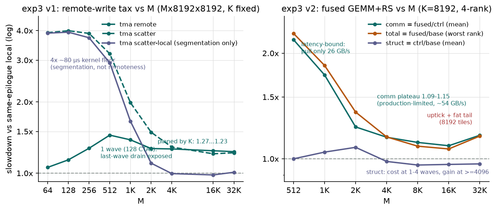

# M-sweep 分析：固定 K=8192 扫 M（4×H800，2026-08-11）

- **数据**：`comm_comp/results_20260811_065005/`（git `0cdb385`，QUICK=0）
- **动机**：flux 论文沿 m 轴评测（decode 点 m=64/512），我们此前只有 K 轴。两条轴都在降
  "每字节 D 携带的 flop"，但机制不同：**K 轴改变通信/计算比（D 不变、计算缩短），
  M 轴保持算术强度恒定（flop/byte-of-D ≡ K）、计算与通信等比缩小**——M 轴上任何税率
  变化都只能来自粒度/延迟，不能来自带宽。跑前预期见 `0cdb385` commit 与本文各节标注。
- **图**：`python plot_msweep.py` → `figs/fig7_msweep.png`
- 主报告（含完整表格）：`BENCHMARK_REPORT_4xH800.md` §1.3 / §1.4

## 0. 可信度

全部 rc=0；锁频 1830 前后一致；fused verify 全 ok（max rel 0.023，阈 0.05）；与
20260810 轮配对点漂移：8192³ tma local −0.35%、fused comm_sd ±1%。另外
**20260810 轮的 signalling 陈旧二进制疑点在本轮解除**：重编译后 pull 4K = 2.56 µs
（旧值 1.62 确系修复前二进制的欠计时）。

## 1. v2 fused：comm 税沿 M 单调收敛，struct 税翻两次牌

（4 rank 均值，K=8192；完整表见主报告 §1.4）

- **comm：2.19 (m=512) → 1.73 → 1.23 → 1.15 → 1.11 → 1.09 (16K) → 1.17 (32K)**。
  预期"wave 饱和后走平"在 4096–16384 兑现。
- **m=512 的失效模式与 K=512 不同**：pull 只有 26.5 GB/s，远低于 88 GB/s 的
  fetch 路径顶棚——不是带宽地板暴露，是**延迟/固定开销**（浅 fetch 流水、barrier、
  逐 tile flag 往返）摊不薄。同一个机制沿两条轴各有一种死法。
- **pull_gbps 平台 ≈54 再证"生产限速"**：m=16384 时 D 产出率 = 16384×8192×2B /
  3722 µs ≈ 72 GB/s，×3/4 = 54.1，与实测一致。
- **struct 非单调，修正 20260810 结论**："结构改造不亏反赚 4%"是**大 shape 限定
  条款**：m≥4096 时 0.96–0.98（倒赚），m=1024–2048 时 1.04–1.08（wave 太少，
  静态调度器只剩量化损失），m=512 回到 ~1.00。
- **m=32768 上翘 ⚠（预期清单里的"如果爬升"项命中）**：comm 1.09→1.17，且仅 fused
  出现肥尾（p95 9013 vs 均值 7924，+14%；base/ctrl 的 p95 正常）。tile 数达 8192
  时 fetch 路径出现随规模增长的成本，候选：flag 数组的 system-scope 自旋足迹、
  等最慢 peer 偏斜随时长放大。**待办：加 iters 单独复跑 m=32768 确认。**
  total 最小点因此落在 m=16384（1.05）。

## 2. v1 epilogue 远端写：税率被 K 钉死，两端各有一个粒度效应

- **m≥2048 平坦在 1.27–1.23**：远端写税由算术强度（K）决定、与问题尺寸无关——
  K 轴曲线（1.24→6.53）的解释就此闭环。
- **m=512 鼓包 1.45 是干净的单 wave 效应**：4×32=128 CTA ≤ 132 SM，全 GEMM 一个
  wave，最后一波的远端写 drain 无后续计算掩护。m=1024（2 waves）1.38、
  m=2048（4 waves）1.27，随 wave 数收敛。
- **m≤256 税缩到 1.06–1.27**：local 自己是延迟受限的（m=64 仅 104 TFLOP/s，写需求
  12.7 GB/s），远端写没碰到链路顶棚，比值被压扁。
- **scatter 系在小 m 归因反转**：m≤256 时 scatter ≈ scatter-local ≈ 3.9×——代价
  100% 是分段本身（4 个 M=16 子 GEMM 各撞 ~80 µs kernel 地板），远端性免费。
  大 m 的"分段免费、代价全在远端性"在小 m 完全倒置。

## 3. 合并两条轴：flux 式 fused RS 在 H800 上的可用域

| | 小 m（<2048） | 大 m（≥4096） |
|---|---|---|
| **小 K（≤2048）** | 双重死：地板 + 延迟 | 通信地板暴露（K 轴：3.0–8.5×） |
| **大 K（8192）** | 延迟失效（M 轴：2.2×@512） | ✅ 甜区：comm 1.09–1.15，total ≤1.13 |

小 m 区间融合仍比切块体面：m=512 时 fused total 2.18 vs v1 scatter（chunk 式近亲）
3.19——kernel 地板 ×4 比浅流水更疼。

## 4. 与 flux 论文对表

- 论文 H800 大 m RS 重叠效率 37–93%（均值 72%）；我们 m=8192 换算
  `E_overlap = 1 − (fused−base)/ECT_nonovl ≈ 79%`（非重叠 RS 以 CE 176 GB/s 估算），落在其区间。
- 论文 H800 小 shape 重叠效率 −165%~−82%（比不重叠还慢）；我们 m=512 换算
  ECT ≈ 128 µs vs 非重叠 ~40 µs，同为负——他们归因"warp 少、latency hiding 失效、
  TMA store 变碎"，与我们"浅流水 + 固定同步开销摊不薄"是同一件事的两种表述。
- 论文 m=64 点我们的 fused 复现不了（`M % (tile_M×world) == 0` 约束，tile 128），
  该区间仅 v1 覆盖——这恰是论文承认需要换小 tile 配置的区间。
