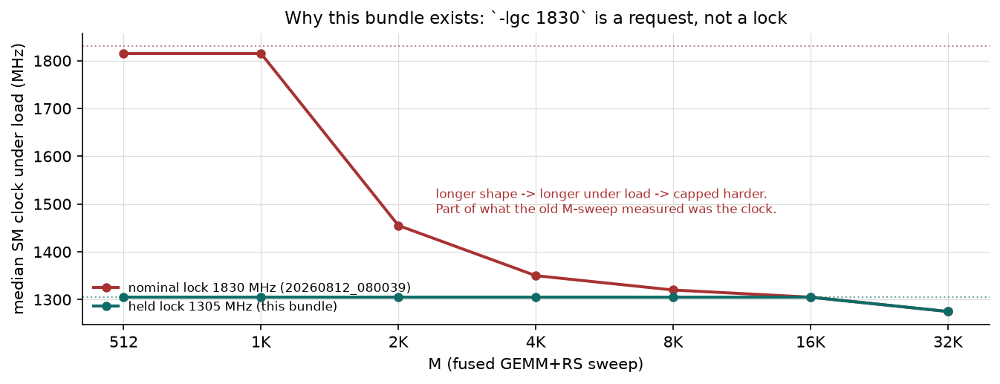
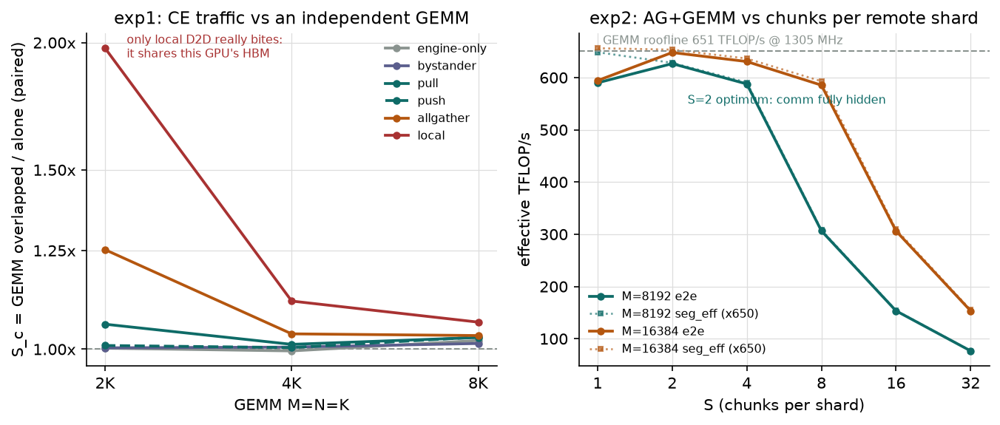
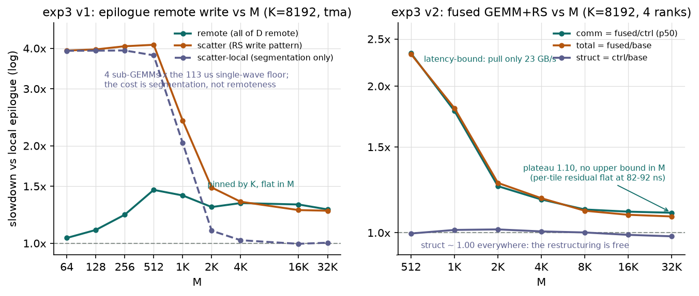

# comm_comp 4×H800 基准测试报告（held-clock 版）

- **日期**：2026-08-12
- **硬件**：4× NVIDIA H800 (80 GiB HBM3)，全互联 NVLink（NV8，单机 NVSwitch）
- **软件**：CUDA 12.9 / nvcc V12.9.41，驱动 535.161.08，CUTLASS 4.6 (submodule)
- **编译**：`-arch=sm_90a`
- **代码版本**：git `36a1446`
- **数据**：`comm_comp/results_20260812_083024/`（QUICK=0，全部 rc=0，`--verify` 全通过，max rel 0.0233 < 0.05 阈值）
- **图**：`python plot_final.py` → `figs/`

> 本报告取代 `../benchmark_4xH800_20260810/` 与 `../benchmark_4xH800_20260811/`。
> 那两个包的**比值**大体成立，**绝对值（TFLOP/s、µs、GB/s）不成立**——原因见 §0，
> 逐条修订史见 §6。

---

## 0. 先决条件：时钟这次是真的锁住了

**`nvidia-smi -lgc N` 是请求，不是保证。** 在这台机器上 `-lgc 1830` 空闲时回读
1830 MHz（97.9% 的空闲样本），一上持续 GEMM 负载就塌到**中位 1380 MHz**、
`sw_power_cap` 在 **79%** 的满载样本里 Active、功耗均值 599 W 峰值 722 W。

**空闲恰恰是功耗墙唯一不生效的时刻**，所以此前"跑前跑后均 1830"的预检
不可能发现这件事——它给 20260810/11 的每一轮都盖了错的章。



危害不是"整体慢一点"，而是**系统性混淆**：shape 越大 → 持续负载越久 → 压得越狠。
上图红线是 fused M-sweep 的满载中位时钟，从 M=512 的 1815 MHz 一路掉到
M=32768 的 1275 MHz——**那条 M-sweep 有一部分测的是时钟，不是算法**。

本轮改锁 **1305 MHz**（由 `./pick_clock.sh` 实测选出），实际守住：

| | 满载中位 | 落在锁频 ±2% | sw_power_cap | M-sweep 跨 shape 时钟差 |
|---|---|---|---|---|
| 旧（标称 1830） | 1380 MHz | ~30% | 79% | **540 MHz（29.5%）** |
| **本轮（1305）** | **1305 MHz** | **81%** | 33% | **30 MHz（2.3%）** |

一个自证的判据：exp2 的 `seg_eff` 在 S=1 时**必须**等于 1.0（切成 1 块 = 不切）。
旧数据是 **1.280**（物理上不可能），本轮是 **0.998**。

**方法学**：串行执行，绝不重叠；每轮预检目标卡空闲 + 空闲时钟 + **满载时钟**
（`load_clock_check`，不通过即中止）；全程 100 ms 采样时钟/功耗/温度/封顶原因到
`gpu_trace.csv`；warmup 按**墙钟**（500 ms）而非迭代数计；exp1 每个 pattern
**紧邻重测基线**；exp3 v2 记录 p50 与逐迭代序列。

---

## 1. exp1：CE 搬运对独立 GEMM 的影响

`S_c = t_overlap / t_alone`，**分母是紧邻该 pattern 重测的配对基线**。



| GEMM | pull | push | allgather | bystander | engine-only | **local** |
|---|---|---|---|---|---|---|
| 8192³ | 1.027 | 1.028 | 1.031 | 1.013 | 1.020 | **1.063** |
| 4096³ | 1.011 | 1.004 | 1.035 | 1.005 | 0.996 | **1.115** |
| 2048³ | 1.058 | 1.008 | 1.252 | 1.003 | 1.002 | **1.975** |

**读法**
- **计算 bound 的大 GEMM 与跨卡 CE 通信几乎互不干扰**：8192³ 下所有跨卡模式
  S_c ∈ [1.013, 1.031]。对照项行为正确（`bystander` 1.013、`engine-only` 1.020，
  两者都不碰这张卡）。
- **唯一真正的代价来自本卡 D2D 争本地 HBM**（`local`）：8192³ 1.063，
  2048³ 高达 **1.975**——小 GEMM 窗口内 D2D 的相对占比压倒性。
  overlap 时 CE 带宽从 828 塌到 115 GB/s。
- **消息粒度**：msg ≥ 4 MiB 后 S_c 稳定在 1.02–1.04 且与 msg 无关；
  1 MiB 时 CE 喂不饱（pull 仅 101 GB/s）。

---

## 2. exp2：搬运粒度 vs 计算效率

真实数据依赖的 AG+GEMM 流水线，扫描每远端 shard 的 chunk 数 S。world=4，pull，3 comm stream。

**M=N=K=8192**（`t_full` = 未分段全 GEMM 基线 1689.0 µs = **651 TFLOP/s**）

| S | t_seg µs | seg_eff | t_comm µs | comm GB/s | t_ovl µs | **e2e TFLOP/s** |
|---|---|---|---|---|---|---|
| 1 | 1692.7 | 0.998 | 578.7 | 173.9 | 1863.5 | 590.0 |
| 2 | 1747.5 | 0.967 | 580.0 | 173.6 | 1754.5 | **626.7** |
| 4 | 1858.6 | 0.909 | 581.2 | 173.2 | 1870.5 | 587.8 |
| 8 | 3561.2 | 0.474 | 579.5 | 173.7 | 3586.9 | 306.5 |
| 16 | 7122.5 | 0.237 | 599.0 | 168.1 | 7167.1 | 153.4 |
| 32 | 14248.6 | 0.118 | 701.1 | 143.6 | 14336.5 | 76.7 |

M=16384 同趋势，**S=2 最优 e2e 648.0 TFLOP/s ≈ roofline**。

**读法**
- **最优 S=2，通信几乎全掩藏**：8192³ 下 626.7 / 651 = 96%；16384 下 648.0 / 651 = **99.5%**。
  flux 的 `SPLIT==1` 合理。
- **代价全在分段的 tile 量化损失**（`seg_eff`）：S≥8 后崩塌，S=32 掉到 77 TFLOP/s。
- **通信并行度与方向都不是瓶颈**：serial(1 stream) S=1 达 647、push S=2 达 630，
  与 pull 的 626.7 在同一水平。

---

## 3. exp3 v1：epilogue 远端写

`slowdown` 相对**同 epilogue 的 `local` 基线**。



**K-sweep（M=N=8192）**

| K | epi | local µs | remote | scatter-local | scatter |
|---|---|---|---|---|---|
| 8192 | tma | 1684.2 | 1.37 | 1.01 | 1.24 |
| 8192 | nosmem | 2068.8 | 2.88 | 0.96 | 2.48 |
| 2048 | tma | 471.3 | 2.11 | 1.05 | 2.05 |
| 2048 | nosmem | 706.1 | 8.10 | 1.09 | 6.46 |
| 512 | tma | 162.9 | 5.58 | 1.15 | 4.66 |
| 512 | nosmem | 411.1 | **13.87** | 1.12 | 10.81 |

**M-sweep（K=8192，tma）**

| M | local µs | TFLOP/s | remote | scatter-local | scatter |
|---|---|---|---|---|---|
| 64 | 113.0 | 76.0 | 1.04 | 3.93 | 3.94 |
| 128 | 113.3 | 151.7 | 1.10 | 3.93 | 3.97 |
| 256 | 113.4 | 303.1 | 1.22 | 3.94 | 4.06 |
| 512 | 117.7 | 583.8 | **1.46** | 3.81 | 4.10 |
| 1024 | 220.1 | 624.4 | 1.40 | 2.04 | 2.39 |
| 2048 | 425.4 | 646.1 | 1.29 | 1.09 | 1.49 |
| 4096 | 851.1 | 646.0 | 1.33 | 1.02 | 1.34 |
| 16384 | 3385.8 | 649.5 | 1.32 | 1.00 | 1.27 |
| 32768 | 6722.6 | 654.2 | 1.27 | 1.00 | 1.26 |

**读法**
- **远端写代价随算术强度下降急剧放大**（K 轴）：tma 1.37→2.11→5.58；
  nosmem 2.88→8.10→**13.87**（非 128-bit 向量化的远端写更贵）。
  这是 flux 在 sm90 刻意不做 epilogue 远端写的原因。
- **M 轴上税率被 K 钉死**：m≥2048 时 remote 平在 1.27–1.33。写入量 ∝ M、
  计算量 ∝ M，M 在分子分母上约掉，剩下的常数只由 K 决定。
- **m=512 鼓包 1.46 是干净的单 wave 效应**：`M/128 × N/256 = 4×32 = 128 CTA ≤ 132 SM`，
  整个 GEMM 只有一个 wave，最后一波的远端写 drain 没有后续计算掩护；
  m=1024（2 waves）1.40、m=2048（4 waves）1.29，随 wave 数收敛。
- **单 wave 地板 = 113 µs**：m=64/128/256 的 local 耗时 113.0/113.3/113.4 µs
  **几乎不变**，而算力精确翻倍（76→152→303 TFLOP/s）。CTA 数 ≤132 时耗时由
  单个 CTA 的深度决定，与 CTA 数量无关。
- **scatter 的归因在小 M 反转**：m≤512 时 `scatter-local`（分段但全本地）
  ≈ `scatter` ≈ 3.9–4.1×，**代价 100% 来自分段本身**——切 4 段 = 撞 4 次
  113 µs 地板 ≈ 452 µs，除以 local 113 µs = 4.0，与实测吻合；远端性一分不收费。
  m≥2048 后 scatter-local 收敛到 1.00–1.09，归因才反转为"分段免费、代价全在远端性"。

---

## 4. exp3 v2：flux sm90 融合 GEMM+RS

融合 pull 式 RS。RS-disabled control 分离代价：`struct_sd=ctrl/base`（结构改造）、
`comm_sd=fused/ctrl`（通信，取 p50）、`total_sd=fused/base`。world=4，多进程（fork+cudaIPC）。

**M-sweep（K=8192，4 rank 均值）**

| M | tiles | base µs | ctrl µs | fused µs | struct | **comm** | total | pull GB/s | ns/tile |
|---|---|---|---|---|---|---|---|---|---|
| 512 | 128 | 118.1 | 117.6 | 274.7 | 0.996 | **2.337** | 2.327 | 22.9 | 1228 |
| 1024 | 256 | 221.3 | 224.2 | 398.8 | 1.013 | 1.778 | 1.802 | 31.6 | 682 |
| 2048 | 512 | 429.6 | 436.3 | 543.7 | 1.016 | 1.246 | 1.266 | 46.3 | 210 |
| 4096 | 1024 | 854.5 | 859.8 | 1005.9 | 1.006 | 1.170 | 1.177 | 50.0 | 143 |
| 8192 | 2048 | 1746.6 | 1746.2 | 1934.4 | 1.000 | 1.114 | 1.108 | 52.0 | **92** |
| 16384 | 4096 | 3496.7 | 3460.2 | 3804.2 | 0.990 | 1.105 | 1.088 | 52.9 | **84** |
| 32768 | 8192 | 6984.8 | 6861.1 | 7535.3 | 0.983 | **1.099** | **1.080** | 53.4 | **82** |

**K-sweep（M=N=8192）**

| K | struct | comm | total | pull GB/s |
|---|---|---|---|---|
| 8192 | 1.000 | 1.114 | 1.108 | 52.0 |
| 2048 | 1.051 | 2.930 | 3.079 | 69.5 |
| 512 | 1.047 | **7.268** | 7.614 | 80.9 |

**读法**
- **结构改造免费**：struct_sd 全程 **0.983–1.016**，8192³ 上正好 1.000。把 2 个空转
  warp（CLC 调度/MainloopAux）改成 RS Fetch/Reduce、加 swizzle、切 smem carveout，
  不亏也**不赚**。
- **全部代价在通信**，且沿 M **单调收敛后走平**：2.337 → 1.778 → 1.246 → 1.170 →
  1.114 → 1.105 → **1.099**。
- **平台是结构性的，不是两点巧合**：把比值还原成绝对残差 C = fused−ctrl 再除以
  tile 数，得到"未被掩藏的每 tile 通信成本"——1228 → 682 → 210 → 143 → **92 / 84 / 82** ns。
  固定的单次启动开销摊完之后，剩下的税纯粹是每 tile 的；而 ctrl 同样 ∝ tile 数，
  所以 comm_sd 必然收敛到常数。**M 方向没有上界。**
- **m=512 的失效模式与 K=512 不同**：pull 只有 22.9 GB/s，远低于 80.9 GB/s 的
  fetch 路径顶棚——不是带宽地板暴露，是**延迟/固定开销**（浅 fetch 流水、
  barrier、逐 tile flag 往返）摊不薄。同一个机制沿两条轴各有一种死法。
- **`pull_gbps` 是生产限速，不是链路限速**：m=16384 时 D 产出率 = 16384×8192×2B /
  3804 µs ≈ 70.6 GB/s，×3/4 = 52.9，与实测一致。M 轴上 NVLink 远未打满
  （exp1 单跑 CE 能到 176 GB/s）。
- **与 v1 对照**：8192³ 下 epilogue 远端写 1.37（tma）/2.88（nosmem），
  融合 pull 式 RS total 1.108——**flux 在 sm90 选 pull 而非 epilogue 远端写，
  在 8192³ 上净占优**，且不破坏 epilogue 的 TMA 路径。低 K 下两者都很贵。

---

## 5. 合并两条轴：可用域

| | 小 m（<2048） | 大 m（≥4096） |
|---|---|---|
| **小 K（≤2048）** | 双重死：地板 + 延迟 | 通信地板暴露（K 轴 2.9–7.3×） |
| **大 K（8192）** | 延迟失效（M 轴 2.34×@512） | ✅ 甜区：comm 1.10–1.17，total ≤1.18 |

一句话：**融合 RS 只在"kernel 足够长到能摊薄固定同步成本、且算术强度足够高到
通信量本身不成瓶颈"时有效**。两个条件分别对应 M 和 K，缺一不可。

**大 M 救不了小 K**（20260812 复跑直接验证）：M=32768 时每个持久 CTA 处理 62 个
tile、重叠机会拉满，K 砍半到 4096 照样把 comm 打到 **1.81**；反向 K 加倍到 16384
降到 **1.049**。通信量由 M×N 定死而计算量 ∝ M·N·K，**算术强度是这条轴上唯一的旋钮**。

甜区里 total 1.08 意味着 **ReduceScatter 被掩藏了约 92%**。

小 m 区间融合仍比切块体面：m=512 时 fused total 2.33 vs v1 scatter（chunk 式近亲）
4.10——kernel 地板 ×4 比浅流水更疼。

### 与 flux 论文对表
- 论文 H800 大 m RS 重叠效率 37–93%（均值 72%）；我们 m=8192 换算
  `E_overlap = 1 − (fused−base)/ECT_nonovl ≈ 79%`（非重叠 RS 以 CE 176 GB/s 估算），落在其区间。
- 论文 H800 小 shape 重叠效率为负（−165%~−82%，比不重叠还慢）；我们 m=512 同为负。
  他们归因"warp 少、latency hiding 失效、TMA store 变碎"，与我们"浅流水 + 固定
  同步开销摊不薄"是同一件事的两种表述。
- 论文 m=64 点我们的 fused 复现不了（`M % (tile_M×world) == 0` 约束，tile 128），
  该区间仅 v1 覆盖——这恰是论文承认需要换小 tile 配置的区间。

---

## 6. 修订史：本报告推翻了什么

| # | 旧结论（20260810/11） | 现状 | 怎么发现的 |
|---|---|---|---|
| 1 | 锁频 1830 MHz，跑前跑后一致 | **错**。满载中位 1380 MHz，79% 时间在功耗封顶 | 加 100 ms 时钟采样后一眼可见；预检只在空闲采样，原理上查不出 |
| 2 | fused comm_sd 在 m=32768 回升到 1.17，"平台并非无限延续" | **不成立**。1.099，与 16384 打平 | 300 iters 复跑；均值与 p50 一致、0% 慢迭代 |
| 3 | 结构改造"不亏反赚 4%"（struct 0.96） | **撤回**。全程 0.983–1.016 | 0.96 从未复现；另有跑序偏置（base 排第一，反序后 +0.008） |
| 4 | exp2 seg_eff 在 S=1 为 1.28 | **物理上不可能**，现 0.998 | 时钟锁住后自动消失 |
| 5 | exp3 v1 单 wave 地板 ~80 µs | **113 µs**（@1305 MHz）；旧值是小 shape 跑在 1830 的产物 | 时钟锁住后 m=64/128/256 才真正齐平 |
| 6 | exp1 的 S_c | 旧值方向对，但分母是块首单次基线，会吸收全部漂移 | 统一 warmup 后 `bystander`/`engine-only` 出现 S_c<1（不可能），暴露单基线设计 |

**方法学教训**（适用于任何在这台机器上跑的基准）
1. **锁频要验满载，不能验空闲**——空闲是功耗墙唯一不生效的时刻。
2. **warmup 要按墙钟计，不能按迭代数**——30 次迭代在 M=32768 是 0.68 s，在 M=512 只有 0.022 s。
3. **比值的分母要紧邻分子测**——单次基线会把两次测量之间的一切漂移吞进比值。
4. **均值会藏尾巴**——CSV 必须同时记 p50；50 次迭代里 2–3 次离群就足以造出一个看起来结构化的效应。
5. **`comm_sd = fused/ctrl` 用本 rank 的 ctrl 当分母会高估通信税**——fused 不可能早于
   最慢 peer 完成，按 `max_r(ctrl_r)` 归一化会低约 0.02。
6. **长套件末端的点不可与短跑对比**——这正是 #2 那个假象的成因。

原始产物与逐项分析：
- 本轮：`comm_comp/results_20260812_083024/`（含 `gpu_trace.csv`）
- m=32768 定性复跑：`ANALYSIS_RERUN_M32768.md` + `comm_comp/rerun_20260812_*/`
- 历史包（比值可用、绝对值不可用）：`../benchmark_4xH800_20260810/`、`../benchmark_4xH800_20260811/`

### 仍未决
- **signalling 未按新口径重跑**：`../benchmark_4xH800_20260811/signalling/` 的形状结论
  （`post≈signal`、`push` 随 size 增长、`push_fence≈push`、单机 NVLink 上 push 中大消息快于 pull）
  是比值/趋势，仍成立；其**绝对 µs 与本报告不同口径**，不可混用。
- **1305 MHz 仍有 33% 的样本在功耗封顶**，p10 = 1260 MHz（−3.4%）。若要更严格，
  用 `./pick_clock.sh 1200 1100` 再降一档。

### 复现
```bash
nvidia-smi -lgc 1305 -i 0,1,2,3          # 值由 ./pick_clock.sh 实测得出
nvidia-smi --query-gpu=index,utilization.gpu --format=csv   # 应全 0
cd comm_comp && CUDA_VISIBLE_DEVICES=0,1,2,3 ./run_all.sh   # 满载时钟不达标会 abort
```
