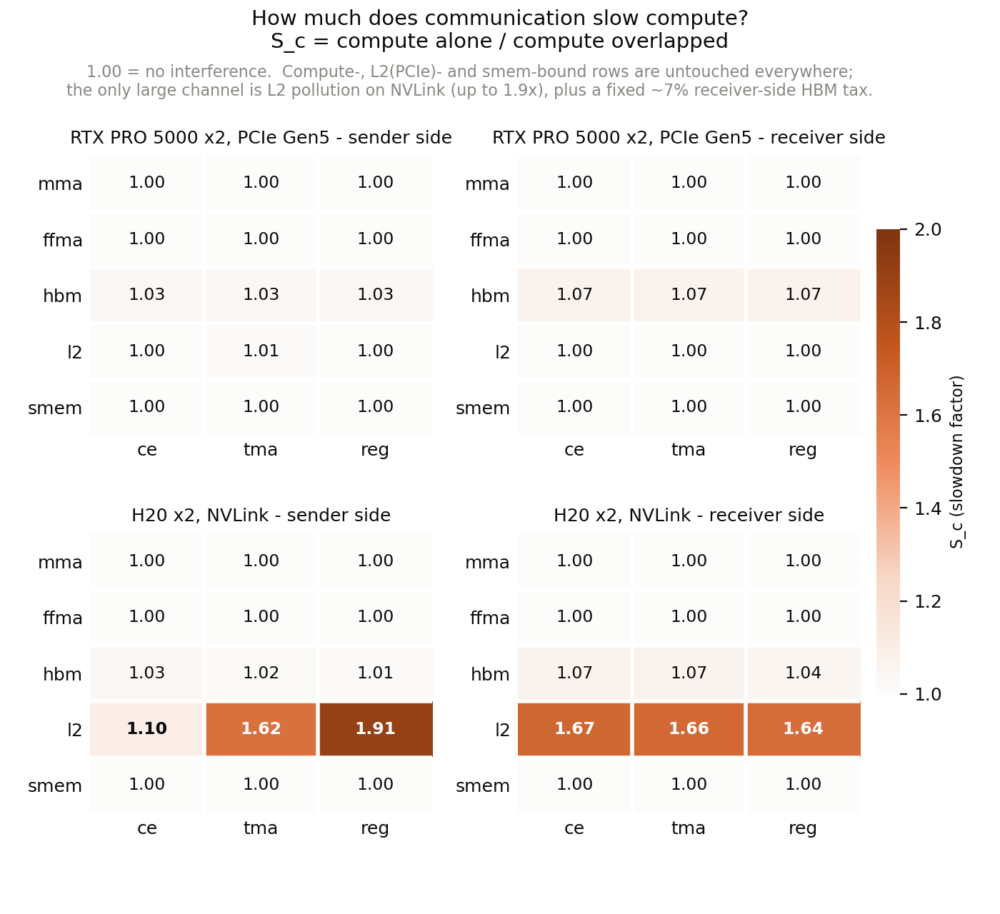
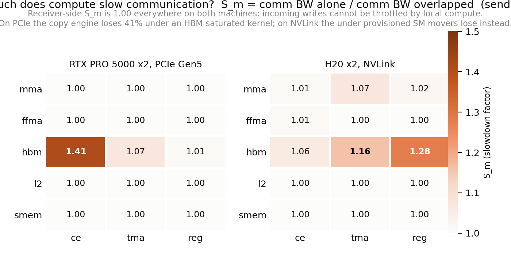
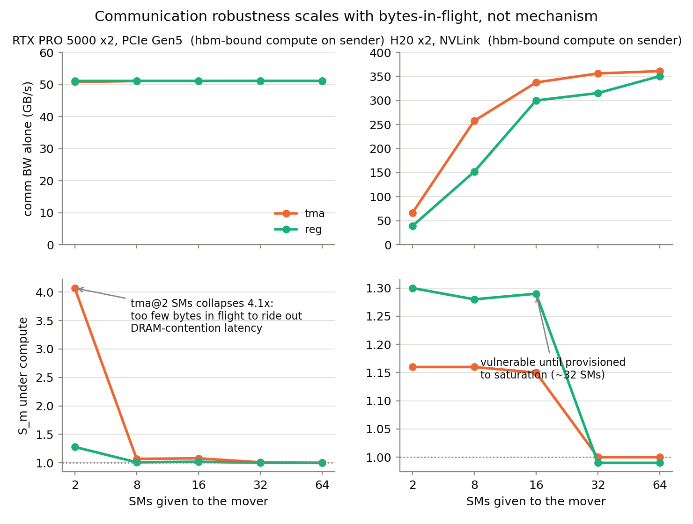
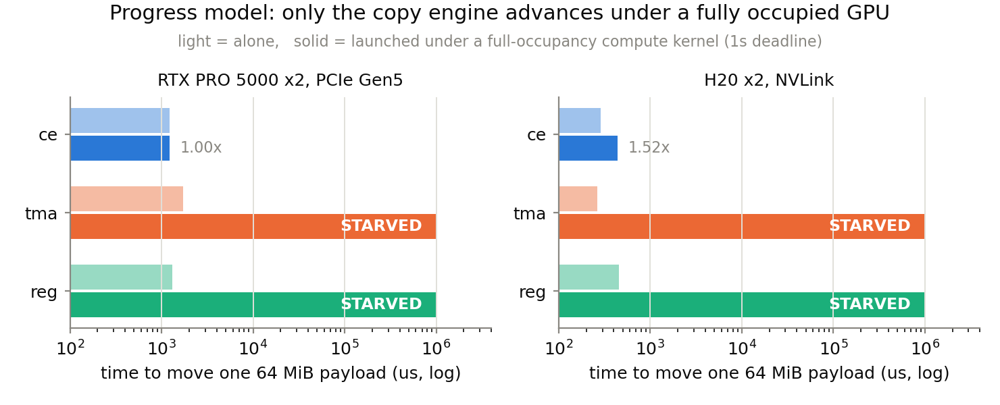
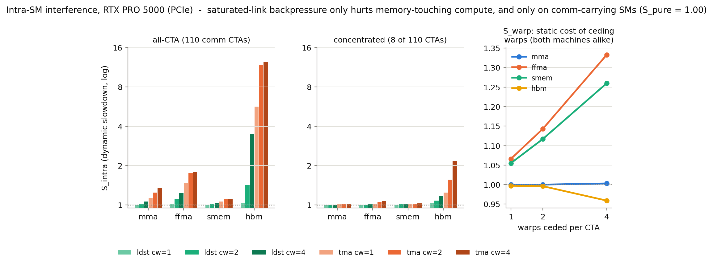
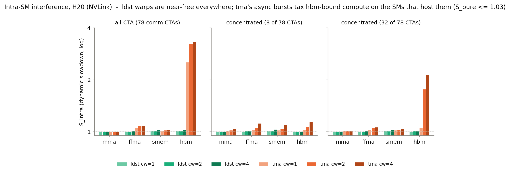
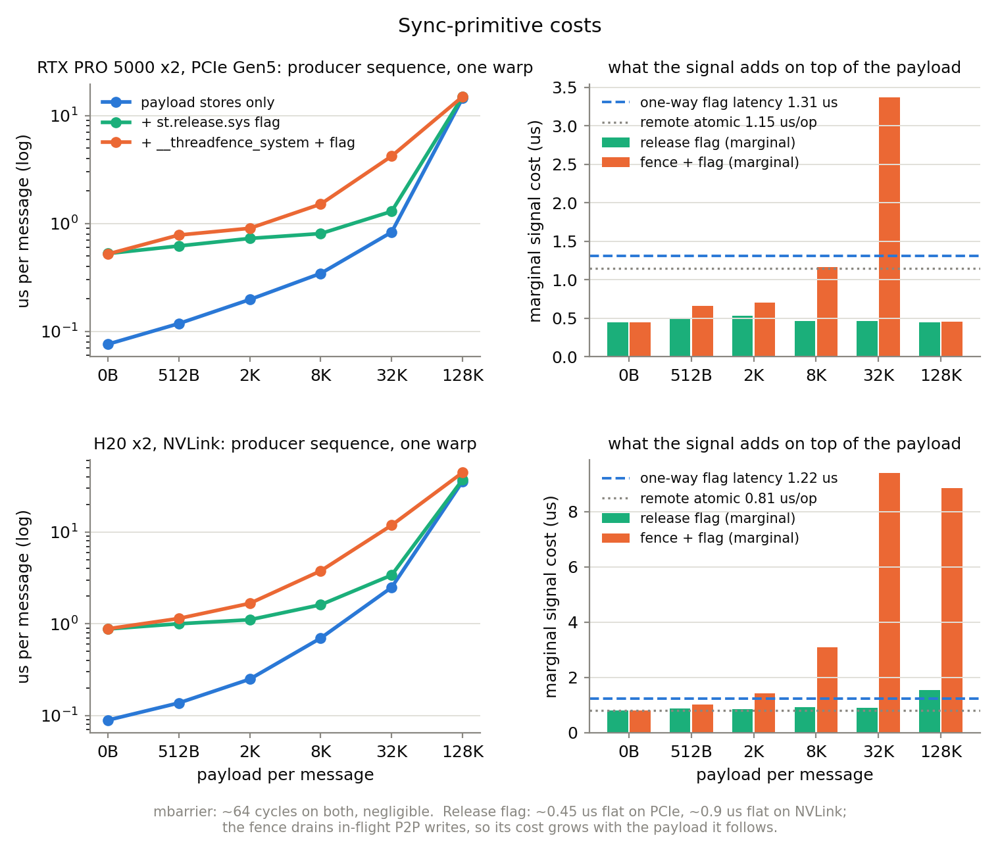
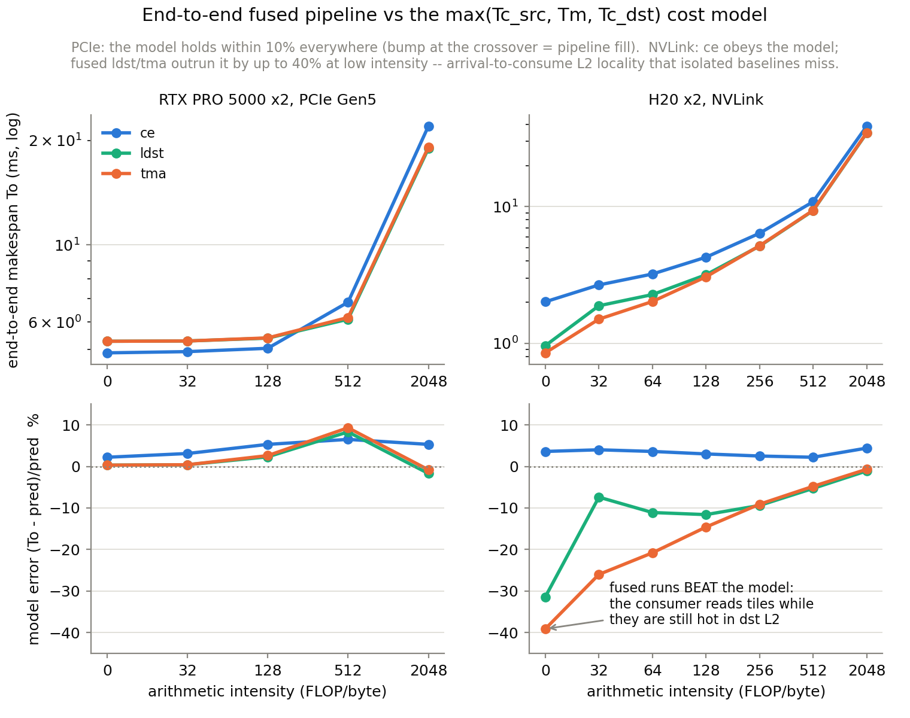

# 通算融合基准分析与路线决策

本文档汇总 `tests/` 下六个微基准在两台机器上的全部测量结果,给出每个干扰通道的量化数据、
跨平台对照,以及由此推导的通算融合(compute-communication fusion)设计决策。

**测试环境**

| 平台 | 卡 | 互联 | SM 数 | 实测链路带宽 |
|---|---|---|---|---|
| `rtx5000` | 2x RTX PRO 5000 72GB Blackwell (sm_120) | PCIe Gen5 x16 | 110 | ~51-56 GB/s |
| `h20` | 2x H20 (sm_90) | NVLink | 78 | ~360-400 GB/s |

**工具与实验映射**

| 工具 | 回答的问题 |
|---|---|
| `pk_bw_sweep` / `p2p_ce_vs_tma` | 三种搬运机制(CE / TMA / ld-st)的裸带宽、饱和粒度、饱和 SM 数 |
| `interference_matrix` | inter-SM 双向干扰矩阵(S_c / S_m)、注入 sweep、starvation |
| `intra_sm_matrix` | warp-specialized 融合内部的干扰(S_intra / S_warp / S_pure) |
| `sync_cost` | 跨卡同步原语成本 |
| `pipeline_e2e` | 端到端融合 pipeline 对 max() 成本模型的验证 |

所有图由 `python plot_interference.py` 从内嵌数据再生;方法学细节见 README。

---

## 1. 通信对计算的干扰(S_c):几乎处处免费,唯一例外是 NVLink 的 L2 污染

- 30 个格子里,compute-bound(mma/ffma)、smem-bound 计算在两个平台、收发两侧**全部 1.00**:
  通信不碰这些资源。
- DRAM 通道的干扰是常数级小量:发送端 1.01-1.03,接收端固定 ~1.07(入站写流的税,
  与发送方式无关,无法靠选型规避)。
- **唯一的大通道:H20 的 L2 污染**。250+ GB/s 的 NVLink 流量把 L2-resident 计算打慢
  1.6-1.9x,收发两侧都存在;发送端 CE 例外(1.10——DMA 读几乎不污染 L2)。PCIe 上该
  通道完全不存在(51 GB/s 的冲刷速率不够快)。
- 注入 sweep(--comm-sms 2..64)证明 S_c 对通信强度**平坦**:在这两个平台上,DRAM
  通道的 S_c 可以当常数进成本模型,不需要建注入率函数。

**结论**:"保护计算"在这两个平台上基本是伪命题;真正要保护的对象随平台而变——PCIe 上是
通信自己的进展,H20 上是 L2。

## 2. 计算对通信的干扰(S_m):脆弱性 = bytes-in-flight,不是机制

- 接收端 S_m 两平台恒为 1.00:入站写不会被本地计算拦住。竞争只发生在**发送端的读**。
- 发送端的排序两平台相反:PCIe 上 CE 最脆(HBM 饱和时丢 41%),SM 系稳;H20 上 CE 稳
  (1.06),欠配置的 SM 系脆(tma 1.16 / reg 1.28)。
- sweep 揭示统一机制:**通信在"饱和配置以下"运行就对计算的内存压力敏感,配置到饱和点即
  免疫**。RTX 的 tma@2SM 崩 4.07x(单发射线程、流水太浅,in-flight 不足以吞下被拉长的
  访存延迟);给到 8 SM 即免疫。H20 的门槛是 ~32 SM。CE 的 in-flight 深度固定、没有旋钮,
  这才是它在 PCIe 内存压力下最脆的真正原因。

**工程数字**:PCIe 上通信预留 8 个 SM(不是裸带宽显示的 1 个)、H20 上 32 个(tma)才能
在任意计算负载旁保住带宽;代价是 compute-bound 计算精确的 k/N,HBM-bound 约为零。

## 3. Progress model:满占用之下只有 CE 能动

满占用 ffma kernel 压住整卡时:CE 照常完成(PCIe 上零影响;H20 上慢 1.52x,疑似 DVFS,
待锁频复核);tma/reg 作为独立 kernel 拿不到 CTA slot,**饿死整整一秒直到计算退出**。

**结论**:SM 系搬运方式只有两种合法部署——融合进已驻留的计算 kernel,或硬预留 SM
(计算 kernel 主动限 grid)。"起满计算再另起通信 kernel"不是性能问题,是死锁级失败。
CE 是唯一可以"扔出去不管"的通道。

## 4. Intra-SM(warp-specialized 融合)的干扰

- **静态代价(S_warp)两平台几乎一致且便宜**:让出 warp 对 tensor-bound 免费
  (mma cw4 仅 0.3%),对 issue/smem-bound 按 warp 数线性(1/16 每 warp)。真实货币是
  warp slot,不是寄存器。
- **PCIe**:每 CTA 1 个 ldst warp = 打满链路 + S_intra 全探针 <=1.03,是最优融合形态;
  **严禁多配**(cw=2/4 带宽不涨,hbm-bound 计算 1.43x/3.49x——多余的通信 warp 只加深
  backpressure)。tma 在深度 backpressure 下 burst 抢访存端口,对 hbm 计算 5.7-12x,
  此场景禁用。集中到 8 个 CTA 时 S_pure=1.00:伤害完全不溢出到无通信的 SM。
- **H20**:角色互换。ldst 处处近乎免费(全员 cw4、349 GB/s、S_intra<=1.03)且全员形态
  合法;tma 效率最高(8 CTA x 4 warp = 303 GB/s)但对承载它的 SM 上的 hbm-bound 计算收
  1.1-3.3x。S_pure<=1.03,同样不溢出。

## 5. 同步原语:release store 是唯一正确答案,信号必须聚合

| 原语 | PCIe | NVLink | 规则 |
|---|---|---|---|
| 单向 flag 延迟 | 1.31 us | 1.22 us | **不随链路带宽降**;per-tile 信号比小 tile 的 payload 还贵,必须按组聚合 |
| release flag(边际) | ~0.45 us,恒定 | ~0.9 us,恒定 | 热路径信号一律用 `st.release.sys` |
| fence+flag(边际) | 最高 3.4 us | 最高 9.4 us | `__threadfence_system` 要排空 in-flight 写,随 payload 增长,禁入热路径 |
| 远端 atomic | 1.15 us/op | 0.81 us/op | 低频计数器可用,别做高频依赖链 |
| 本地 mbarrier | ~64 cycles | ~64 cycles | 可忽略 |

## 6. 端到端验证:模型闭环,并发现一个模型外的红利

- **PCIe**:`max(Tc_src, Tm, Tc_dst)` 零参数模型全域误差 <10%(交叉点 ~FLOP/B 500 附近
  有流水 fill 的 8-9% bump,两端 <3%)。无需干扰修正项——与 S_c~1 的矩阵自洽。融合相对
  CE 的收益只在 compute-bound 端(+14%,来自消除 kernel 边界/chunk 尾巴,不是传输路径)。
- **H20**:CE 依然服从模型(+2-4%);**融合方法击穿模型下界 5-40%**——消费者读到的是刚
  到达、还热在 dst L2 里的 tile,而孤立测量的 Tc_dst 是冷读 HBM(仅 ~190 GB/s,消费端
  是低强度下的真瓶颈)。I=0 时 fused tma 0.85ms vs CE 2.01ms,**快 2.4x,且全强度域融合
  都赢**。
- 对"融合省一跳 HBM"论点的最终裁决:省的不是发送端 staging(PCIe 验证不值钱,HBM 余量
  吸收),而是**接收端的冷读**——这一项只有端到端实验能暴露。

**成本模型定稿**:CE 用 `max()` 原式;融合方法的 `Tc_dst` 必须用热消费版本(或加 L2-hot
修正项);同步项按第 5 节代入并聚合摊薄。

---

## 7. 汇总:两平台选型决策表

| 场景 | RTX5000 / PCIe | H20 / NVLink |
|---|---|---|
| 独立通信流(预取、背景 collective) | CE;若必须与 HBM-heavy 阶段重叠且在乎通信时延,专用 ldst kernel @8 预留 SM(S_m 1.01 vs CE 1.41) | CE(可预测、进展独立),但端到端弱于融合 |
| 融合 producer,compute-bound 计算 | 每 CTA 1 个 ldst warp(全员)或集中 8 CTA;tma/ldst 等价 | tma 8 CTA x 4 warp(303 GB/s, S<=1.12)或 32 CTA x 2(374 GB/s) |
| 融合 producer,HBM-bound 计算 | 同上,仍 <=1.03;禁 tma 全员形态 | **全员 ldst cw2-4**(349 GB/s, S<=1.03);tma 对承载 SM 收 1.1-3.3x |
| L2 敏感计算(KV cache、驻留权重) | 无此通道,随意 | 发送端选 CE(1.10 vs 1.6-1.9);接收端只能调度错开或 `cudaAccessPolicyWindow` 保护工作集 |
| 低算术强度 / 纯搬运 | CE 略胜(-8%) | fused tma,快 2.4x(L2-hot 消费) |
| 信号 | release flag 0.45 us、聚合 | release flag 0.9 us、聚合 |
| 部署红线 | comm warp 每 CTA 最多 1 个;独立 SM 系 kernel 必须硬预留 | 独立 SM 系 kernel 必须硬预留;tma 别放进 hbm-heavy 的 CTA |

自动调优需要的平台参数向量(全部已测得):
`{链路带宽, 饱和 SM 数(tma/reg), S_c(通道, 侧), S_m(负载), S_warp 斜率, S_intra 表,
单向延迟, release flag 成本, L2-hot 消费收益}`。

---

## 8. 下一步:通算融合怎么做

### 8.1 运行时结构(直接可实现的设计决定)

1. **三后端并存,按上表路由**:CE(host/graph 提交)、fused-ldst、fused-tma,不做单一
   后端。选择器输入 = (平台, 数据当前位置, 计算瓶颈类型, 算术强度, 消息粒度)。
2. **融合 kernel 骨架**:producer 计算 warp + 通信 warp 同 CTA;通信 warp 数是
   per-platform 常量(PCIe: 1 ldst warp/CTA;H20: tma pipeline 或 ldst cw2-4)。
   信号统一 release store,按 tile 组聚合(组大小 >= 单向延迟/每 tile 传输时间)。
3. **消费端设计成"追着 L2 消费"**:consumer 以到达顺序 poll(acquire load + polite
   spin),消费滞后控制在 L2 容量内——这是 H20 上 2.4x 的来源,应作为一等设计目标而非
   副作用。
4. **预留机制**:凡是独立 SM 系通信 kernel,与计算 kernel 之间用 grid 配额硬分割
   (persistent compute 限 N-k);有条件的平台(CUDA >= 12.4)升级为 green context
   硬分区,同时消除 intra-SM 实验里 CTA 布局的不确定性。

### 8.2 待补的测量缺口(按优先级)

1. **全双工与多对卡**:目前所有数据都是 2 卡单向。MoE 实际是每卡同时收发 + 多对并发,
   发送读、接收写、双向链路会同时竞争——需要把 interference_matrix 扩展成双向模式
   (两卡互推 + 双侧探针),这可能改变 S_m 的绝对值。
2. **真实算子验证**:用一个真实 MoE dispatch/combine(或 TP AllGather+GEMM)替换合成
   探针,验证决策表给出的配置确实端到端最优,并校准 L2-hot 收益在真实消费模式
   (GEMM 而非流式读)下的幅度。
3. **H20 锁频复核**:starvation 中 CE 的 1.52x 疑似 DVFS;拿到宿主机权限后锁频重跑
   starve + 矩阵各一遍,把功率耦合从干扰数据中剥离或确认为独立项。
4. **探针 ILP 修正**:H20 的 hbm/l2 探针只打到 1.1/4 TB/s(并发度受限),对应行的 S_c
   是下界;给探针加 4 路独立访存后重测,确认真饱和下 L2/DRAM 通道的干扰上限。
5. **NVLink 专属机会**:multimem/NVLS(broadcast/reduce 类 collective 的第四种通道)
   与 `cudaAccessPolicyWindow` 保护 L2 的实效,都未测。

### 8.3 里程碑建议

- M1:把第 7 节决策表编码成 tileccl 的后端选择器 + 两个平台的参数文件(数据已齐)。
- M2:融合 kernel 模板(producer/consumer 骨架 + 聚合信号)落地,用 pipeline_e2e 的
  工况回归验证不劣于本文数字。
- M3:补全双工/多卡矩阵(8.2-1),更新参数文件。
- M4:真实 MoE 算子端到端对比 NCCL/CE 基线,产出最终报告。
